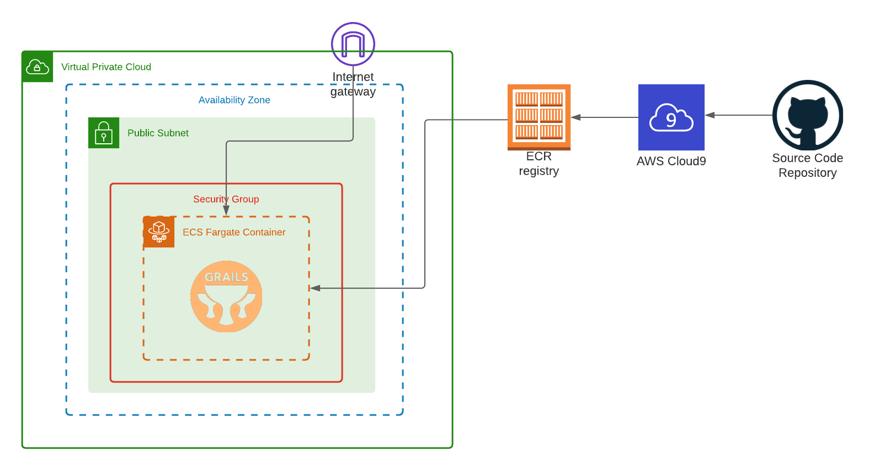
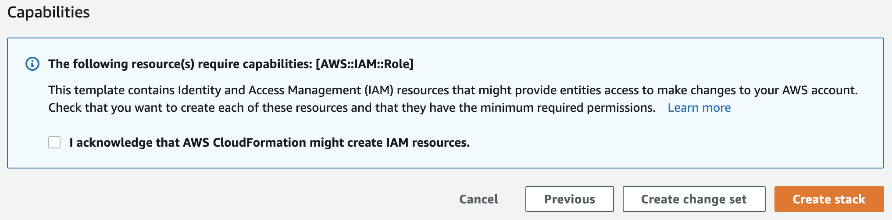
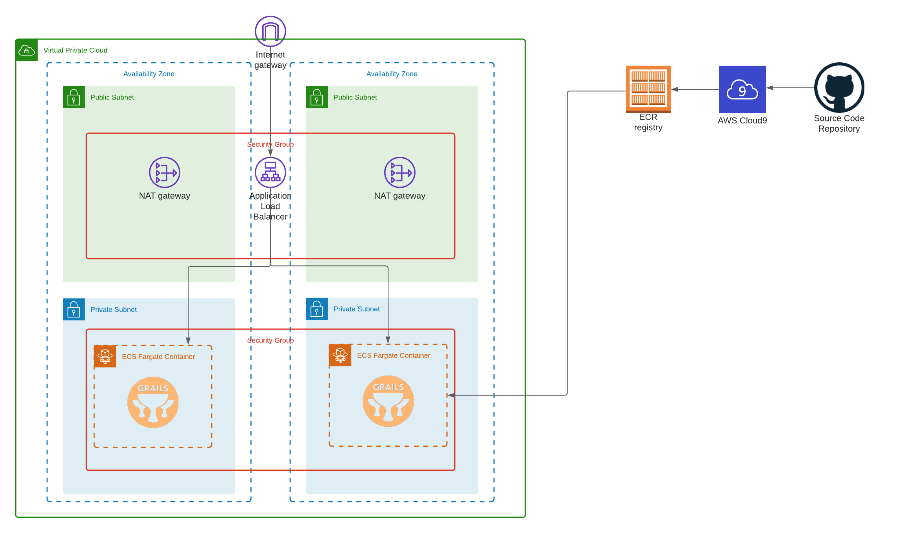
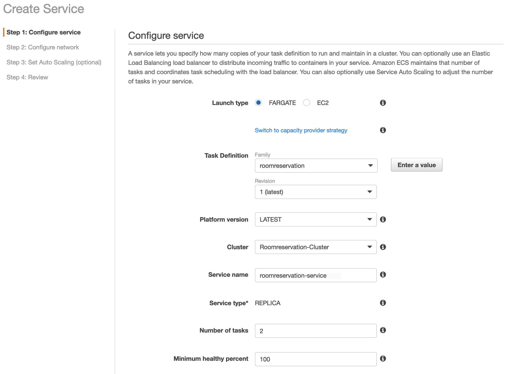
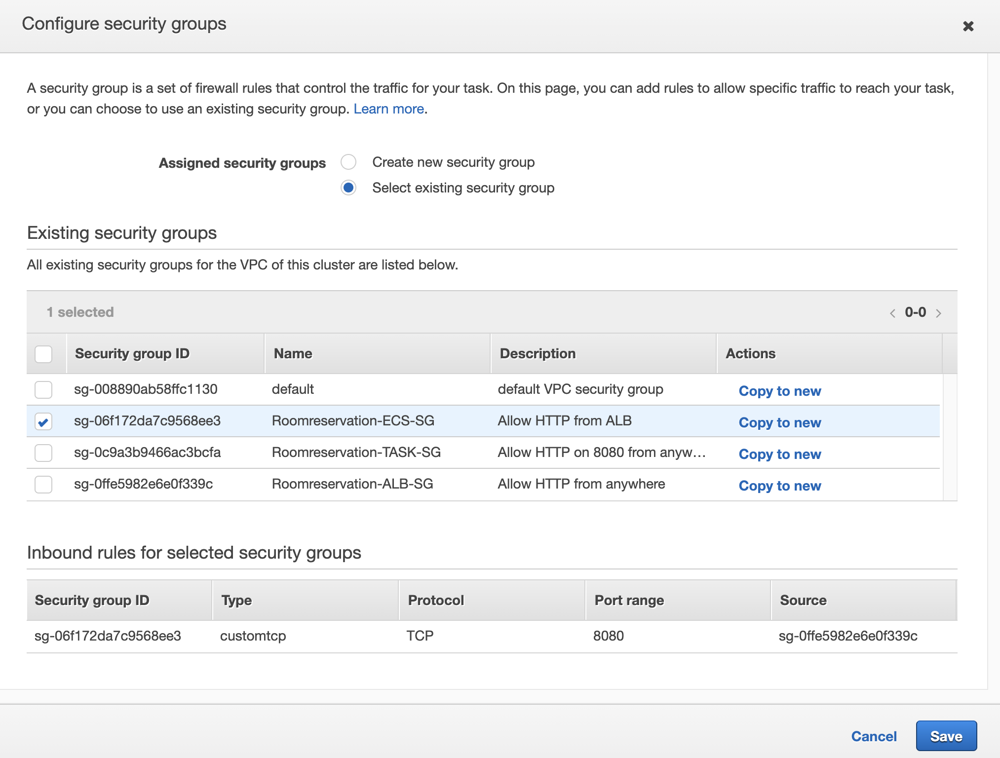
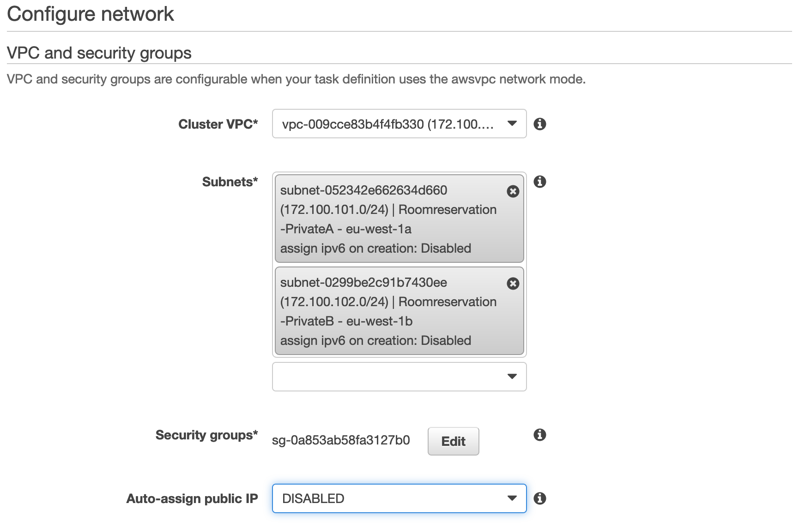
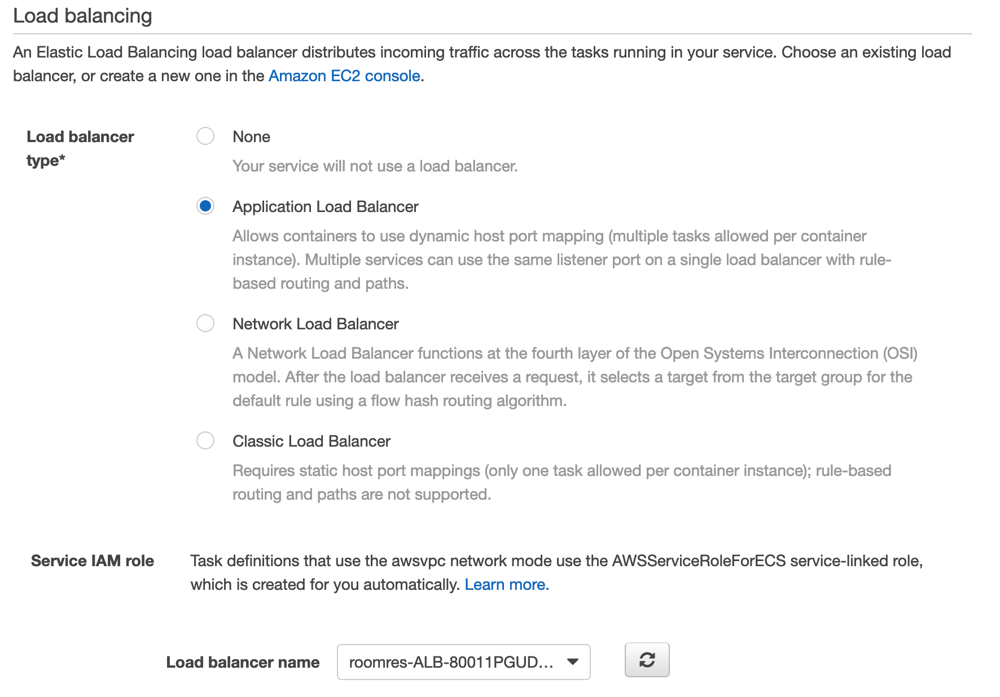
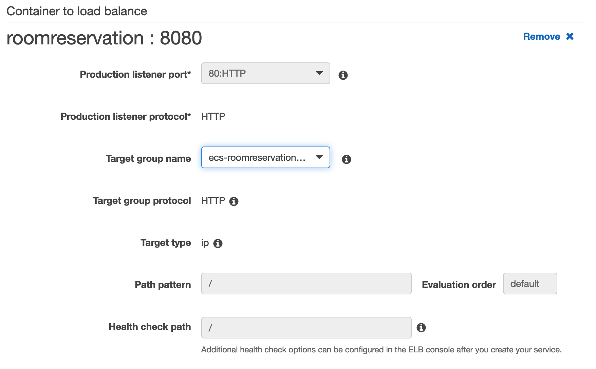
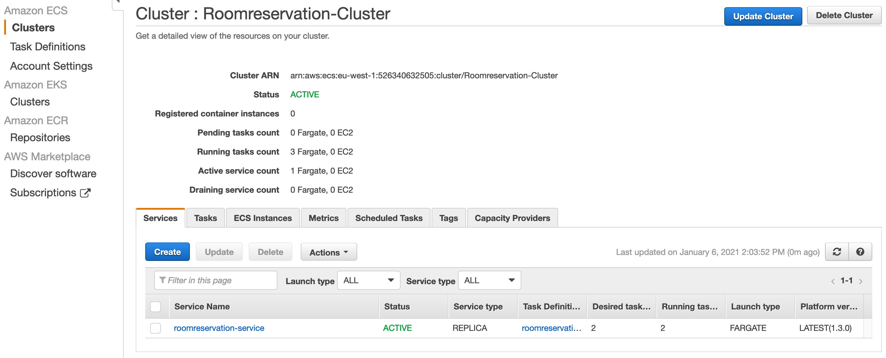
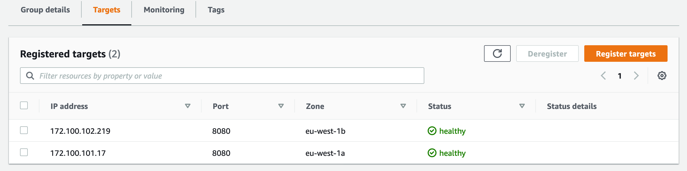

# Introduction #

This workshop is part of the WebDeployment lecture and considered a hands-on practical example on how deploy a sample Java application based on Amazon ECS Fargate container solution. It consists of 2 Lab sections and you will be guided through the all the steps needed.
# Lab 1 #

This is a basic hands-on lab which should be run as part of the lecture. First, you will login and familiarize yourself with the AWS Console and the environment. You will launch a template to automatically deploy and provision the base infrastructure needed for the entire workshop. All sources are stored in this repository which will be cloned to a AWS Cloud9 instance, a web based IDE. You will build a Docker image containing the sample Java application and push it to the Amazon ECR container registry. The image will be deployed and executed on Amazon ECS. You will run through all steps needed to deploy this single Docker image.

The architecture looks like this:

<kbd></kbd>


## Login to the AWS Console ##

You will need access to an AWS Account in order to conduct this lab. Either you're having your own one, or you will be given access to an AWS environment.

## Prepare the environment ##

We will be using a couple of AWS services for this lab. The base infrastructure setup is available as a CloudFormation template. If you want to learn more what and how it is deployed - the template "environment_setup.yaml" is stored in this repository under "Infrastructure".

Services deployed by the AWS CloudFormation template:
- Networking Stack (VPC) + Security Groups
- AWS Cloud9 IDE
- Amazon ECS Cluster (Fargate)
- Amazon ECR container repository
- Elastic Load Balancer, Listener and Target Group

### Deploy the template ###

Make sure you are logged into the AWS Console and right click on "Launch Stack" + "Open in new Tab" below to automatically deploy the stack in the Frankfurt Region (eu-central-1):

[](https://console.aws.amazon.com/cloudformation/home?region=eu-central-1#/stacks/new?stackName=roomreservation&templateURL=https:%2F%2Ffhnw-web-deployment.s3.eu-central-1.amazonaws.com%2Fenvironment_setup.yaml "Launch Stack")

- After clicking the link a new AWS Console window with CloudFormation will open
      
- In Step 1 "Specify template" leave the settings and click "Next"
- In Step 2 "Specify stack details" leave the existing stack name "roomreservation" and click "Next"
- In Step 3 "Configure stack options" scroll down and click "Next"
- In Step 4 "Review" scroll down, check "I acknowledge that AWS CloudFormation might create IAM resources." and click "Next"
      
- The Stack will be deployed automatically. This takes about 5 minutes. You can follow the creation process under "Events" and see the "Resources" deployed

### Access AWS Cloud9 IDE ###
AWS Cloud9 is fully managed IDE and provides the AWS SDK, AWS Cli and has Docker pre-installed. 
- In the AWS Console select "Services" and type "Cloud9"
- Click "Open IDE" on your instance. This will open a new window in your Browser and show the Cloud9 GUI

 
 
### Clone Repository ###
- Select the terminal window and make sure you're in the folling directory:
```bash
<some_name>:~/environment $ 
```
- Paste the following command to the terminal window:
```bash
git clone https://github.com/cvolkmer/fhnw-web-deployment.git
```
- You should now see the contents from the repository on the left side under the "Environments" section.

## Create and deploy your container ##

### Explore Amazon ECR ###
- Open a seaparate Browser tab (clone an existing tab)
- In the AWS Console select "Services" and type "Elastic Container Registry"
- Click on the existing registry and open it


- Make sure there is no image in the registry
- Click on "View push commands" to get the instructions needed for the next steps.

### Build your image ###
- Go back to your Cloud9 browser window
- In the terminal window, navigate into the following directory containing the Dockerfile + the .war-File of your application
```bash
cd fhnw-web-deployment/container/
```
- Follow the push commands (steps 1-4) from ECR and copy / paste them to the terminal window in Cloud9
  - First, you will obtain temporary login credentials
  - Then you will build your container image locally in Cloud9
  - After that you will tag the image and
  - Upload (push) it to the ECR registry

    

- You can close the push commands instructions by clicking "Close"
- If you go back to the container registry, should see one image with the tag "latest"


### Create a new task definition ###

A task definition is required to run Docker containers in Amazon ECS. For example, you specify parameters like the Docker image to be used, CPU and Memory, Networking mode, Logging and more.

- In the AWS Console select "Services" and type "Elastic Container Service"
- In the left navigation pane under "Amazon ECS" click on "Task Definitions" 
- Click on "Create a new Task Definition"
- Select "Fargate" in the launch type compatibility screen and click "Next step"
- In the task and Container Definitions page provide the following inputs:
  - As the "Task Definition Name" enter "roomreservation"
  - Select "None" in the "Task Role"
  - In the "Task execution IAM role" select "roomreservation-ECSTaskExe......"
  - Under "Task size" select "2GB" task memory and "1 vCPU"
  - In the "Container Definitions" click on "Add container"
  - Enter "roomreservation" under "Container Name"
  - Copy the ECR URI to your container image into the "Image" section. You can obtain it from your Cloud9 terminal (bash history). The URI looks like this and was used in the "docker push" command: 
    ```
    123456789012.dkr.ecr.eu-central-1.amazonaws.com/roomreservation:latest
    ```
  - Enter port "8080" in the "Port mappings" section
  - Leave all other sections and click "Add"
  - Back in the task definition screen make sure that "Enable App-Mesh integration", "Enable proxy configuration" and "Enable FireLens integration" are NOT selected
  - Click "Create" and "View task definition" to proceed and create the new task definition

Congratulations, you have successfully created a new task definition. In the next step you will run a Docker container from the task definition you've created.

### Run the task ###

You will manually run a single Docker container. In production, you would create a Service (see Lab 2) to automatically run, scale and make your containers highly available.

- Click on "Task Definitions" under "Amazon ECS" in the left navigation pane
- Select the "roomreservation" Task definition and click on "Actions" => "Run Task"
- Under "Launch type" select "Fargate"
- In the "Cluster VPC" section, select the "Roomreservation-VPC" VPC with CIDR 172.100.0.0/16
- You can select any public subent, for example "Roomreservation-PublicA - eu-central-1a"
- Under "Security groups" click "Edit"
- In the following window, check "Select existing security group" and select the Security group named "Roomreservation-TASK-SG" and click "Save"
- Leave all other options unchanged and click on "Run Task" at the bottom of the page
- In "Cluster : Roomreservation-Cluster" under "Tasks" you will find a new task being provisioned. The status should change from "PROVISIONING" to "RUNNING" shortly.
- Click on the Task name itself to open the task details
- In the "Network" section copy the "Public IP" and enter the following URL in a new Browser tab to verify your application is running. It might take a short time until the application is started:
   ```
   http://<your_container_ip>:8080
   ```
  
You've successfully started your first Docker container on Amazon ECS!

# Lab 2 #

In Lab 1, you've created a task definition which describes the Docker container and it's parameters. You've manually launched a container task from the task definition. The goal if this lab is to make your deployment highly available behind a load balancer. An Amazon ECS service enables you to run and maintain a specified number of instances of a task definition simultaneously in an Amazon ECS cluster. If any of your tasks should fail or stop for any reason, the Amazon ECS service scheduler launches another instance of your task definition to replace it in order to maintain the desired number of tasks in the service.

In addition to maintaining the desired number of tasks in your service, you can optionally run your service behind a load balancer. The load balancer distributes traffic across the tasks that are associated with the service.

The target architecture will look like this:


## Create a service ##
- Navigate to the "Clusters" section of Amazon ECS
- Click on "Roomreservation-Cluster"
- In the "Service" tab click "Create"
- As "Launch type" select "Fargate"
- Make sure the "Task Definition" is "roomreservation" and the "Cluster" is "Roomreservation-Cluster"
- Under "Service name" enter "roomreservation-service"
- In "Number of tasks" enter 2
  
- Click on "Next step" at the bottom of the page
- In the "Cluster VPC" section, select the "Roomreservation-VPC" VPC with CIDR 172.100.0.0/16
- As "Subnets", select the 2 private Subnets called "Roomreservation-PrivateA" and "Roomreservation-PrivateB"
- Under "Security groups" click "Edit" and select the "Roomreservation-ECS-SG"
  
- Set "Auto-assign public IP" to "Disabled"
  
- In the Load balancing section, select "Application Load Balancer" as "Load balancer type"
- Under "Load balancer name" check that "roomres-ALB-..." is selected
  
- Under "Container to load balance" make sure "roomreservation:8080:8080" is selected and click on "Add to load balancer"
- In the "Production listener port" select "80:HTTP"
- Under "Target group name" select "ecs-roomreservation-service"
    
- Click on "Next step"
- In the "Service Auto Scaling" leave the default setting "Do not adjust the service’s desired count" and click "Next step"
- Review the configuration and click "Create Service"
- Make sure all configuration steps are successful (green) and click "View Service"
- You should now see a new service and after a short time, 2 container instances should be up and running
    

## Check Application Status ##

The Elastic Load Balancer has been created already by the AWS CloudFormation script. You can now check the Load Balancer configuration and container status.

- In the AWS Console, select "Services" and type "EC2"
- Scroll down to the "Load Balancing" section on the left navigation and click on "Target Groups"
- Open the target group called "ecs-roomreservation-service"
- Click on "Targets" - you will see your 2 container instances which have been launched by the service definition. You can also observe their helath status and that they have been launched in different Availability Zones (AZ). They should show up with status "healthy".
      
- In the "Load Balancing" section on the left navigation, click on "Load Balancers"
- In the "Description" field in the middle, you will find the "DNS name" like
    ```
    roomres-ALB-XXXXXXXXXXXX-XXXXXXXX.eu-central-1.elb.amazonaws.com
    ```
- Open a new Browser tab and enter the URL
   ```
   http://roomres-ALB-XXXXXXXXXXXX-XXXXXXXX.eu-central-1.elb.amazonaws.com
   ```

Congratulations! You have launched your sample application hightly available behind an Elastic Load Balancer on Amazon ECS!
