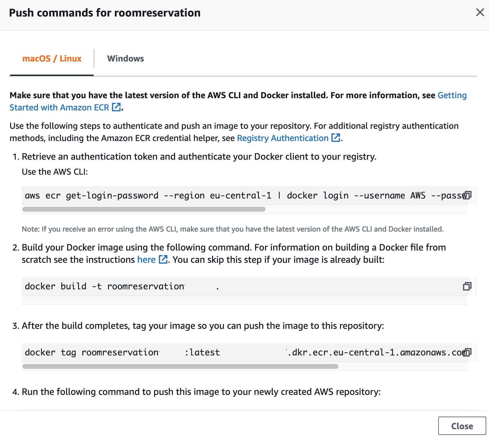

# Introduction #

In this lab you will deploy a sample Java application based on Amazon ECS Fargate container solution. You will be guided through the all the steps needed.

# Login to the AWS Console #

You will need access to an AWS Account in order to conduct this lab. Either you're having an existing one, or you will be given access to an AWS environment.

# Prepare the environment #

We will be using a couple of AWS services for this lab. Please use [the CloudFormation template](https://github.com/cvolkmer/fhnw-web-deployment/blob/master/infrastructure/environment_setup.yaml) to automatically setup the infrastructure needed. The template will setup most of the infrastructure components and you can concentrate on the container part. For this lab, we will be using the Frankfurt (eu-central-1) region. Please make sure you clone this repository to a local directory.

Services deployed by the CloudFormation template:
- Cloud9 IDE
- ECS Cluster (Fargate)
- ECR container repository
- RDS MySQL
- Application LoadBalancer (ELB)

## Deploy the template ##
- In the AWS Console, select "Services" and type "CloudFormation"
- On the right side in the CloudFormation window, click on "Create stack" and select "With new resources (standard)"
- Under "Specify template" select "Upload a template file" and click "Choose file"
- Select the file "environment_setup.yaml" in the "infrastructure" directory of this repository and click "Next"


- Use "roomreservation" as "Stack name"
- Leave the default values for the other parameters


- Provide and note down a DBUsername and DBPassword parameter and click "Next"
- On the "Configure Stack options" page scroll down and click "Next"
- On the next page scroll down, select the checkbox under "Capabilities" and click "Create stack"


- The Stack will be deployed automatically. This takes about 10 minutes. You can follow the creation process under "Events" and see the "Resources" deployed

## Access Cloud9 IDE ##
Cloud9 is fully managed IDE and provides the AWS SDK, AWS Cli and has Docker pre-installed. 
- In the AWS Console select "Services" and type "Cloud9"
- Click "Open IDE" on your instance. This will open a new window in your Browser and show the Cloud9 GUI

 
 
## Clone Repository ##
- Select the terminal window and make sure you're in the folling directory:
```bash
<some_name>:~/environment $ 
```
- Paste the following command to the terminal window:
```bash 
git clone https://github.com/cvolkmer/fhnw-web-deployment.git
```

# Create and deploy your container #

## Explore ECR ##
- Open a seaparate Browser tab (clone an existing one)
- In the AWS Console select "Services" and type "Elastic Container Registry"
- Click on the existing registry and open it


- Make sure there is no image in the registry
- Click on "View push commands" to get the instructions needed for the next steps.



## Build your image ##
- Go back to your Cloud9 browser window
- Navigate into the following directory containing the Dockerfile + the .war-File of your application
```bash
cd fhnw-web-deployment/container/
```
- Follow the push commands from ECR and copy / paste them to the terminal window
- First, you will obtain temporary login credentials
- Then you will build your container image locally in Cloud9
- After that you will tag the image and
- Upload (push) it to the ECR registry

## Create a new task definition ##

- Go back to your browser tab where you have ECR open
- Close the push instructions and click on "Task Definitions" in the left navigation pane
- Click on "Create a new Task Definition"
- Select "Fargate" in the launch type compatibility screen an click "Next step"
- In the task and Container Definitions page provide the following inputs
- As the task definition name enter "roomreservation"
- Select the task role which begins with "roomreservsation-...."
- In the "Task execution IAM role" select "ecsTaskExecutionRole" or "Create new"
- Under "Task size" select "2GB" task memory + "1 vCPU"
- In the Container Definitions click on "Add container"
- Provide "roomreservation" as your container name
- Copy the ECR URI to your container image into the "Image" section
- Enter port "8080" in the port mappings section
- Leave all other sections and click on "Create"
- Back in the creation of the task definition screen make sure to deselect "Enable App-Mesh integration", "Enable proxy configuration" and "Enable FireLens integration"
- Click "Create" to proceed and create the new task definition

## Run the task ##


## Important to remember##
- Put container in PRIVATE subnet and assign the ALB to ECS security group
- Define container with port 8080
- Deploy container image to ALB with path "/roomreservation" and order "1"
- Make sure the healthcheck goes to "/" and NOT to "/roomreservation"
- In the ALB Target Group change the health check port form "80“ to "8080"